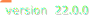

## BetterData [](https://github.com/gmankab/betterdata) [](https://www.python.org)

[](https://t.me/gmanka)
[](https://discordapp.com/users/396578935540023296)
[](https://github.com/gmankab/betterdata)

```
oooooooooo.   oooooooooo.
`888'   `Y8b  `888'   `Y8b
 888     888   888      888
 888oooo888'   888      888
 888    `88b   888      888
 888    .88P   888     d88'
o888bood8P'   o888bood8P'

```

### [Докумениация на английском](https://github.com/gmankab/betterdata/blob/main/readme.md)
### [Documentation in english](https://github.com/gmankab/betterdata/blob/main/readme.md)


## Оглавление
- [Принципы](#принципы)
- [Документация](#документация)
  - [Функции](#функции)
    - [install_libs](#install_libs)

## Принципы


- Портативность
- Минимальный вес
- Максимальная стабильность
- Библиотека не привязана к определенной
операционной системе
- Библиотека поддерживает только последнюю
версию python на момент релиза
- По возможности откажитечь от использования
pip по следующим причинам:
  - pip весит довольно много - 15 мегабайт.
Если вы используете python embeddable на windows,
который тоже весит 15 мегабайт,
то после установки pip вес папки увеличится
в 2 раза - до 30 мегабайт.
  - pip хранит все библиотеке в папке python.
Во первых из-за этого папка python
очень быстро растет в размере.
Во вторых это противоречит идее портативности.
Портативная программа должна хранить
все нужные библиотеке в своей папке,
а не в папке python.
В третьих, хранение всех библиотек
в одном месте вызывает конфликты версий,
если 2 разные программы требуют 2 разные версии
одной и той же библиотеки.
  - pip нестабилен, установка пакета через pip
может завершиться с ошибкой.
Безусловно, если вы знакомы с python и pip,
то для вас не будет
особой пробелемой решить ошибку.
Давайте подумаем, что будет когда вы
пустите свой код в прод.
Либо вы поставляете свой код сразу
вместе с библиотеками, которые ваш код
использует (что невозможно сделать, если
ваш проект поставляется как всего один
исполняемый файл),
либо встроить в свою программу
способ загрузить все нужные библиотеки.
Если делать это через pip,
то у юзера может возникнуть ошибка
во время установки пакета.
Поэтому bettedrata содержит в себе
написанный мною легковесный и стабильный
способ загрузки библиотек,
подробнее о котором далее в документации.
  - Конечно, betterdata никак
не конфликтует с pip, и если он вам нужен,
вы можете продолжать его использовать.


## Установка
Т. к. я не люблю pip, сейчас скачать betterdeta
можно только со страницы
[github releases](https://github.com/gmankab/betterdata/releases).
Тем не менее, в будущем
возможно betterdata можно будет
установить через pip.
Библиотека betterdata состоит
из всего одного python файла,
который автоматически установит
все зависимости нужных версий без
использования pip.
Скачайте со страницы
[github releases](https://github.com/gmankab/betterdata/releases).
файл bd.py и положите его
в папку вашего python проекта.

Пусть папка проекта будет
называться `project`, а файл
вашего проекта `main.py`.
Тогда папка проекта должна
выглядеть вот так:
```
project/
├── main.py
└── bd.py
```
Откройте `main.py` и импортируйте
в него библиотеку betterdata:
`import bd`
После первого запуска вы сразу увидите,
как bettedrata начала устанавливать
свои зависимости:


## Документация

### функции

#### install_libs
```python
bd.install_libs()
```
